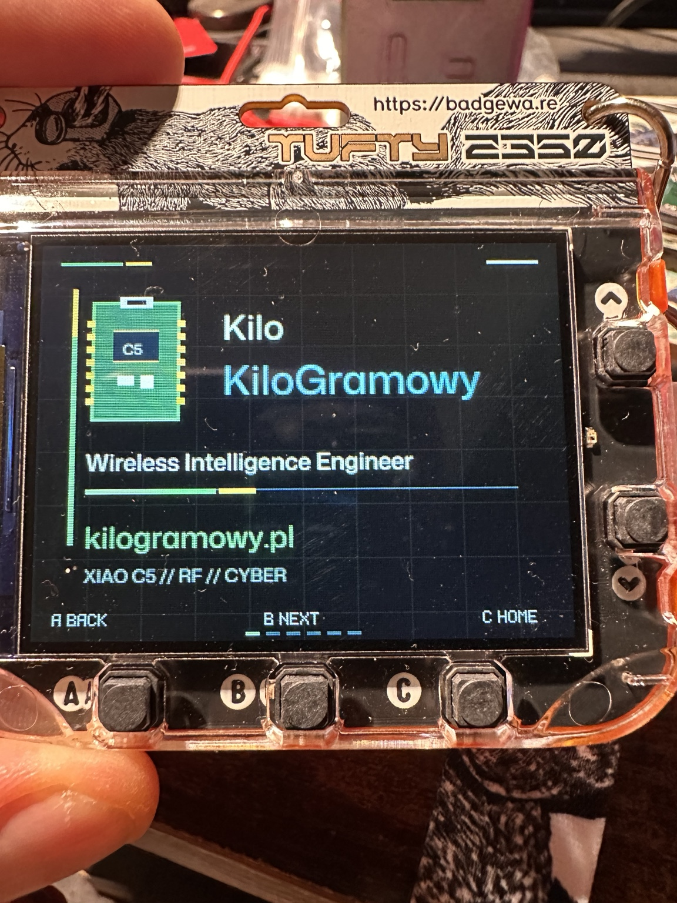
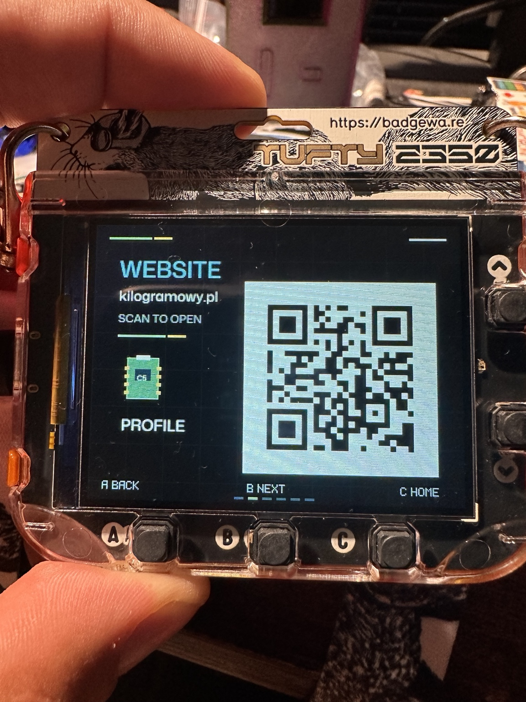
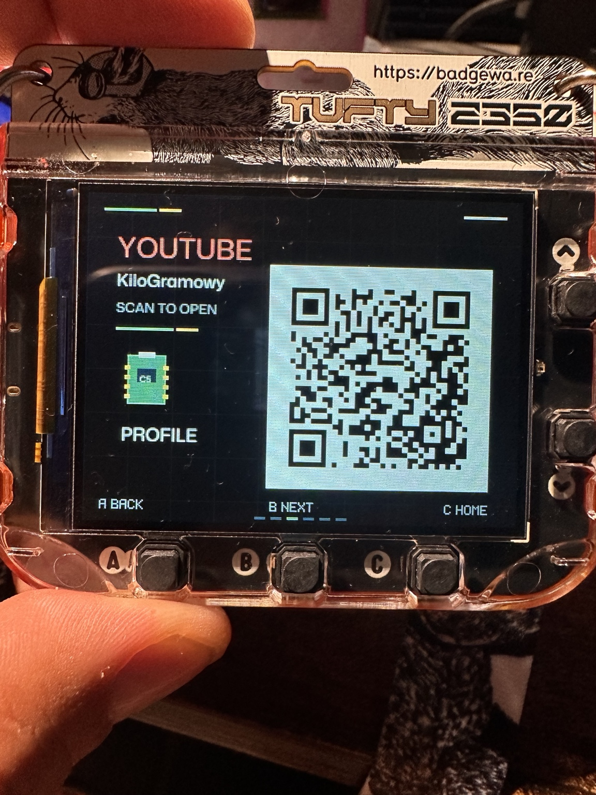
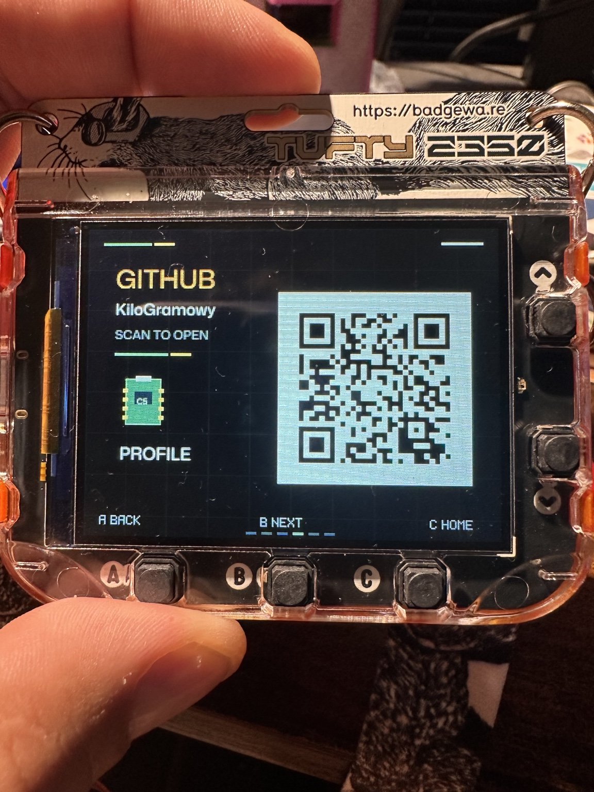
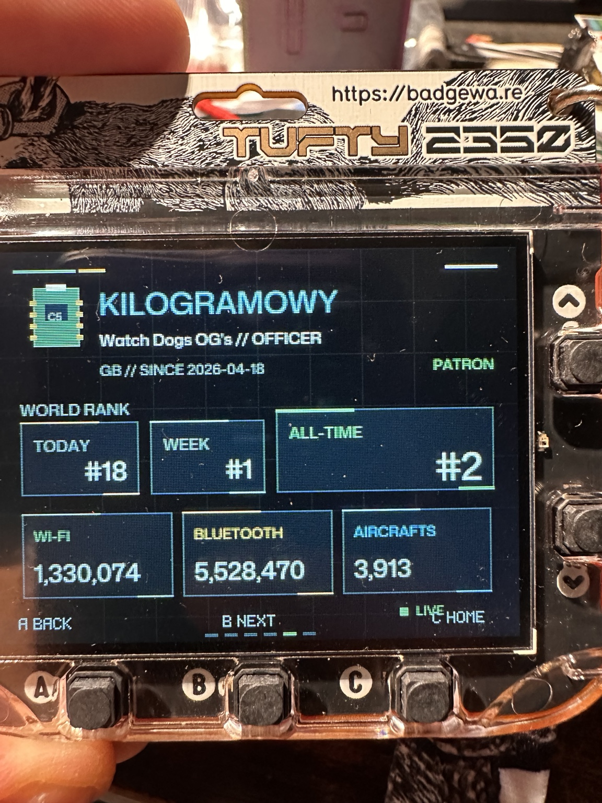
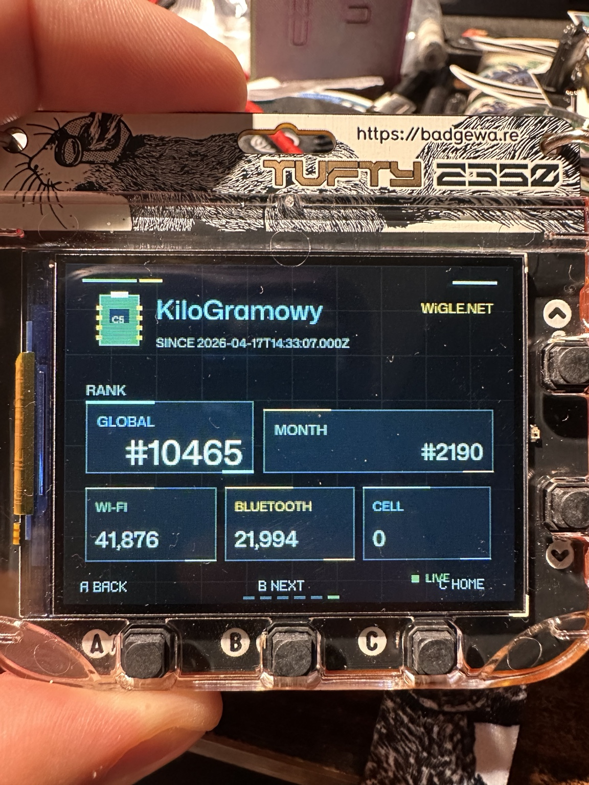

# Tufty Profile Hub 📟

**Created by [KiloGramowy](https://github.com/KiloGramowy)**

[https://kilogramowy.pl](https://kilogramowy.pl)

Configurable multi-page personal profile badge for the Pimoroni Tufty 2350 with QR pages, WDGWars and WiGLE integrations.

Tufty Profile Hub turns a physically tested personal Badgeware app into a reusable open-source template. You edit small JSON files on your computer, run a builder, and copy the generated app folder to your Tufty 2350.



## 📸 Hardware Demo

Profile Hub running on a physical Pimoroni Tufty 2350. WDGWars and WiGLE screens below show live data from the hardware-tested runtime.

<table>
  <tr>
    <td align="center" width="50%">
      <br>
      <strong>Website QR</strong>
    </td>
    <td align="center" width="50%">
      <br>
      <strong>YouTube QR</strong>
    </td>
  </tr>
  <tr>
    <td align="center" width="50%">
      <br>
      <strong>GitHub QR</strong>
    </td>
    <td align="center" width="50%">
      <br>
      <strong>WDGWars LIVE</strong>
    </td>
  </tr>
  <tr>
    <td align="center" width="50%">
      <br>
      <strong>WiGLE LIVE</strong>
    </td>
    <td align="center" width="50%">
      <br>
      <strong>Main profile</strong>
    </td>
  </tr>
</table>

## ✨ Features

- Configurable main profile page for name, role, primary label, and technical tagline.
- Arbitrary QR pages generated from `profile.json` links.
- Default page flow: Main -> Website -> YouTube -> GitHub -> WDGWars -> WiGLE.
- A/B/C navigation: `A = BACK`, `B = NEXT`, `C = HOME`.
- WDGWars integration with setup-safe blank credentials.
- WiGLE.net integration with setup-safe blank credentials.
- Standard Pimoroni `/secrets.py` Wi-Fi with non-fatal offline handling.
- Automatic ambient-light display brightness using Tufty 2350's built-in light sensor.
- Host-side QR generation, so Tufty does not need `qrcode` or Pillow.
- 24x24 PNG launcher icon inspired by the XIAO ESP32-C5 board shape.

## 🚀 Quick Start

Install the builder dependency on your computer:

```bash
python -m pip install -r requirements-builder.txt
```

Create private local config files:

```bash
cp profile.example.json profile.json
cp credentials.example.json credentials.json
```

Edit `profile.json` and `credentials.json`, then build:

```bash
python build_profile.py
```

Copy the generated folder:

```text
dist/profile_hub/
```

to your Tufty:

```text
TUFTY:/apps/profile_hub/
```

Do not commit generated builds. `dist/profile_hub/` may contain private Wi-Fi or API credentials.

## 🛠️ Configuration

Identity text lives in `profile.json`:

```json
{
  "name_line1": "Your",
  "name_line2": "Name",
  "job_title": "Wireless Intelligence Engineer",
  "primary_label": "example.com",
  "tagline": "XIAO C5 // RF // CYBER"
}
```

The public Kilo demo preset is in `presets/kilo_demo.json`. It contains only public links and no credentials.

## 🔗 QR Pages

Add any link to `profile.json` and the builder creates the QR matrix automatically:

```json
{
  "id": "mastodon",
  "title": "MASTODON",
  "label": "@user@example.social",
  "url": "https://example.social/@user",
  "accent": "blue"
}
```

QR generation happens on the host computer:

```text
URL -> build_profile.py -> generated_qr.py -> Tufty QR renderer
```

Badgeware does not need the CPython `qrcode` or Pillow packages. Generated Tufty builds keep only compact `QR_CODES` data.

## 📡 WDGWars

WDGWars is visible by default. If `wdgwars_api_key` is blank, the page shows a setup message and makes no authenticated API request.

The runtime uses:

- `https://wdgwars.pl/api/me`
- `https://wdgwars.pl/api/leaderboard`
- `X-API-Key` authentication

The page focuses on username, team/gang metadata when available, today/week/all-time ranks, and Wi-Fi/Bluetooth/Aircraft statistics. All-time rank is visually dominant.

## 🌐 WiGLE.net

WiGLE is visible by default. If either `wigle_api_name` or `wigle_api_token` is blank, the page shows a setup message and makes no authenticated API request.

The runtime uses WiGLE API v2:

- `https://api.wigle.net/api/v2/profile/user`
- `https://api.wigle.net/api/v2/stats/user`
- HTTP Basic Authentication with WiGLE API Name and API Token

The screen keeps the compact reliable subset: username, global rank, monthly rank, discovered Wi-Fi, discovered Bluetooth, and discovered cellular networks.

## 🔄 Refresh Policy

Profile Hub does not contact WDGWars or WiGLE automatically at app startup.

The active WDGWars or WiGLE page becomes eligible for refresh when that page is entered or when its configured 6-hour refresh interval has elapsed. A 60-second per-integration cooldown prevents repeated requests from quick `NEXT` / `BACK` navigation.

Profile Hub is a Badgeware app, not an operating-system daemon. It does not refresh while another Badgeware app is running, while the launcher is open, while the device is powered off, or while Profile Hub is not running.

Loss of Wi-Fi is treated as a normal non-fatal condition. If live statistics were previously downloaded, Profile Hub keeps the cached in-memory values on screen and marks the integration as cached/offline. This OFFLINE/CACHED behaviour, WDGWars live data, WiGLE live data, QR navigation, and A/B/C responsiveness have been confirmed on a physical Pimoroni Tufty 2350.

Stage 1 still performs the real API HTTP request synchronously after Wi-Fi is connected. A short temporary pause during a live WDGWars or WiGLE request is expected and documented; it is not a crash or fatal Wi-Fi error.

## 📶 Wi-Fi

By default, Profile Hub is compatible with Pimoroni's standard root `/secrets.py`:

```python
WIFI_SSID = "..."
WIFI_PASSWORD = "..."
```

Profile Hub uses `profile_hub/safe_wifi.py` for Wi-Fi. It starts connection attempts without invoking Pimoroni's fatal system Wi-Fi helper and returns `True`, `None`, or `False` for connected, connecting, or unavailable/failed states. Missing access points, wrong passwords, timeouts, and missing `/secrets.py` values stay inside the Profile Hub UI as normal OFFLINE/CACHED states.

## 💡 Brightness

Profile Hub adapts display brightness automatically using Tufty 2350's built-in ambient light sensor. Dark environments stay readable at a low minimum brightness, normal indoor lighting uses a comfortable mid-range, and strong light raises the screen to full brightness. The screen is never automatically turned off, and no external hardware is required.

## 🔐 Security

Actual credentials are private.

Never commit:

- `profile.json`
- `credentials.json`
- `dist/`
- real Wi-Fi SSIDs or passwords
- WDGWars API keys
- WiGLE API names or tokens

`.gitignore` excludes those local files by default.

## 📦 Installation

1. Put Tufty 2350 into Disk Mode.
2. Open the `TUFTY` drive on your computer.
3. Copy `dist/profile_hub/` to `TUFTY:/apps/profile_hub/`.
4. Eject the drive cleanly.
5. Launch Profile Hub from Badgeware.

Future packaging work can adapt the same app folder for `/system/apps/profile_hub` or `/system/contrib/profile_hub`.

## 🧪 Testing

Run local checks:

```bash
python -m compileall build_profile.py profile_hub tests
python -m unittest discover -s tests
python build_profile.py --profile profile.example.json --credentials credentials.example.json
```

Confirmed physical Tufty 2350 validation for this Stage 1 runtime baseline:

- BadgeWare launcher visibility and app launch
- Main, Website, YouTube, GitHub, WDGWars, and WiGLE pages
- Website, YouTube, and GitHub QR pages
- Responsive A/B/C forward/back/home navigation, including QR pages
- WDGWars and WiGLE OFFLINE behaviour with no Wi-Fi
- WDGWars and WiGLE LIVE data after adding credentials
- No fatal grey system Wi-Fi error and no forced reset

## 📚 Docs

- [Architecture](docs/ARCHITECTURE.md)
- [Integrations](docs/INTEGRATIONS.md)
- [Wi-Fi](docs/WIFI.md)
- [Badgeware](docs/BADGEWARE.md)
- [Screenshots](screenshots/README.md)

## License

MIT
